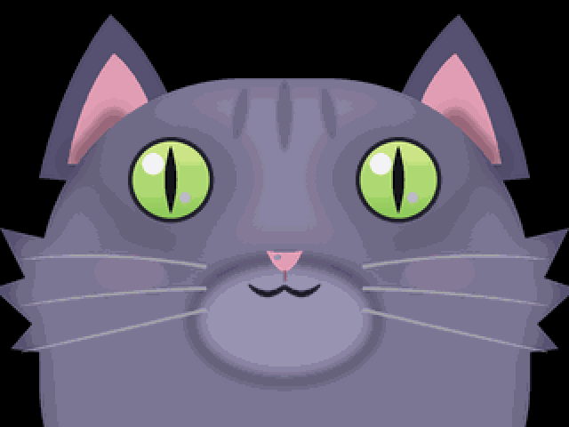
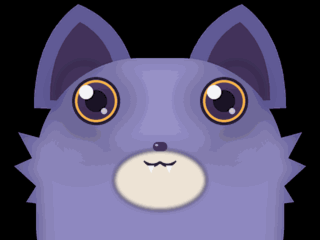
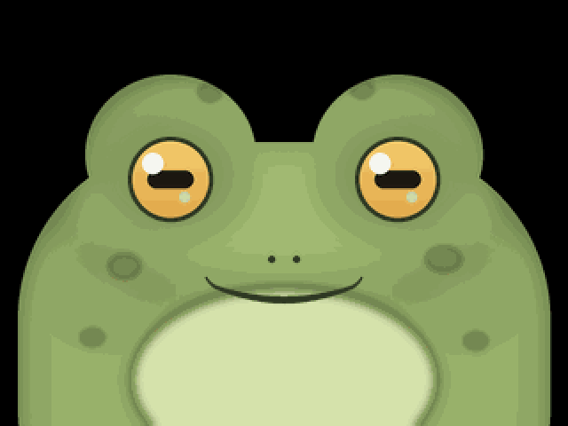
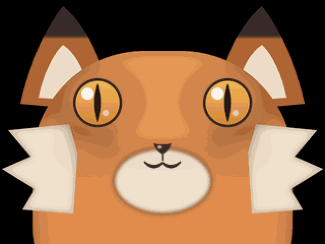

# familiar

A self-hosted, local-network voice companion for the StackChan ESP32-S3 robot.
No cloud: the little robot on your desk wakes when called, hears you, thinks,
and speaks back — all on hardware you own.

**[→ Quickstart](QUICKSTART.md)** &nbsp;·&nbsp; **[→ Using your familiar](using.md)**

---

The name is the witch's-companion kind: a *familiar* is a spirit bound to a
person. This project is the two halves of ours:

- **poppet** — the body. ESP32-S3 firmware for the M5Stack StackChan: mic,
  speaker, display face, head servos, and an on-device wake word.
- **grimoire** — the mind. A Go server on your LAN that hears
  (whisper.cpp), thinks (any OpenAI-compatible LLM), and speaks (Kokoro TTS).

They talk over one WebSocket on your network. Nothing leaves the house.

## Meet the familiars

Say **"be a cat"** (or bat, toad, fox) and the face on the display changes —
and stays changed across reboots. These are the actual sprite skins the
firmware renders, blinking and speaking:

| | |
|:---:|:---:|
|  |  |
| *"be a cat"* | *"be a bat"* |
|  |  |
| *"be a toad"* | *"be a fox"* |

## Where to start

| I want to… | Read |
|---|---|
| Get from a clean clone to a talking robot | [Quickstart](QUICKSTART.md) |
| Learn what it can do day-to-day | [Using your familiar](using.md) |
| Understand the firmware (the body) | [Poppet deep dive](poppet.md) |
| Understand the server (the mind) | [Grimoire deep dive](grimoire.md) |
| Train a wake word for my own voice | [Wake word](WAKE_WORD.md) |
| Read the wire contract between the halves | [Protocol v2](PROTOCOL_V2.md) |
| Meet the projects familiar descends from | [Sources & lineage](sources.md) |

## The stack at a glance

```
 "Hey Artemis…"                        your LAN, and only your LAN
┌──────────────┐   WebSocket   ┌──────────────┐   HTTP   ┌─────────────┐
│    poppet    │ ────────────► │   grimoire   │ ───────► │  LLM server │
│  (StackChan) │   Opus audio  │ (Go backend) │          │ (llama.cpp/ │
│ mic·face·srv │ ◄──────────── │ whisper ASR  │ ◄─────── │  vLLM/…)    │
└──────────────┘  audio+text   │ Kokoro TTS   │          └─────────────┘
                               └──────────────┘
```

- **Private by architecture** — the device only ever talks to your server; the
  privacy guarantee is a firewall rule, not a promise
  ([network isolation](https://github.com/TaraTheStar/familiar/blob/main/poppet/BUILD.md)).
- **CPU-only friendly** — whisper `base.en` and Kokoro run comfortably on a
  modest Linux box; the LLM lives wherever you already serve one.
- **Yours to shape** — persona file for its personality, MCP servers for its
  tools, sprite sheets for its faces, your own recordings for its wake word.

## License

Dual-licensed by subtree: `grimoire/` is AGPL-3.0-or-later; everything else
(`poppet/`, docs, tooling) is MIT. The two halves are separate programs talking
over a socket, so the copyleft does not cross the wire. Full acknowledgements
in the [repository README](https://github.com/TaraTheStar/familiar#license--acknowledgements).
